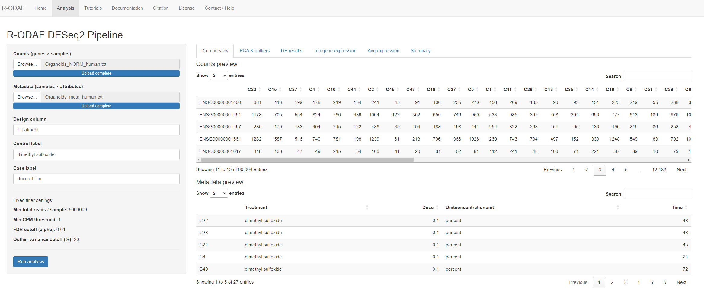
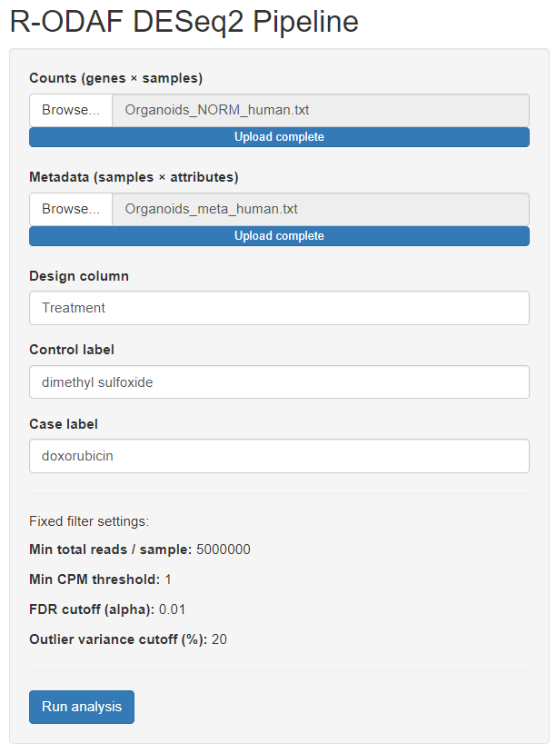
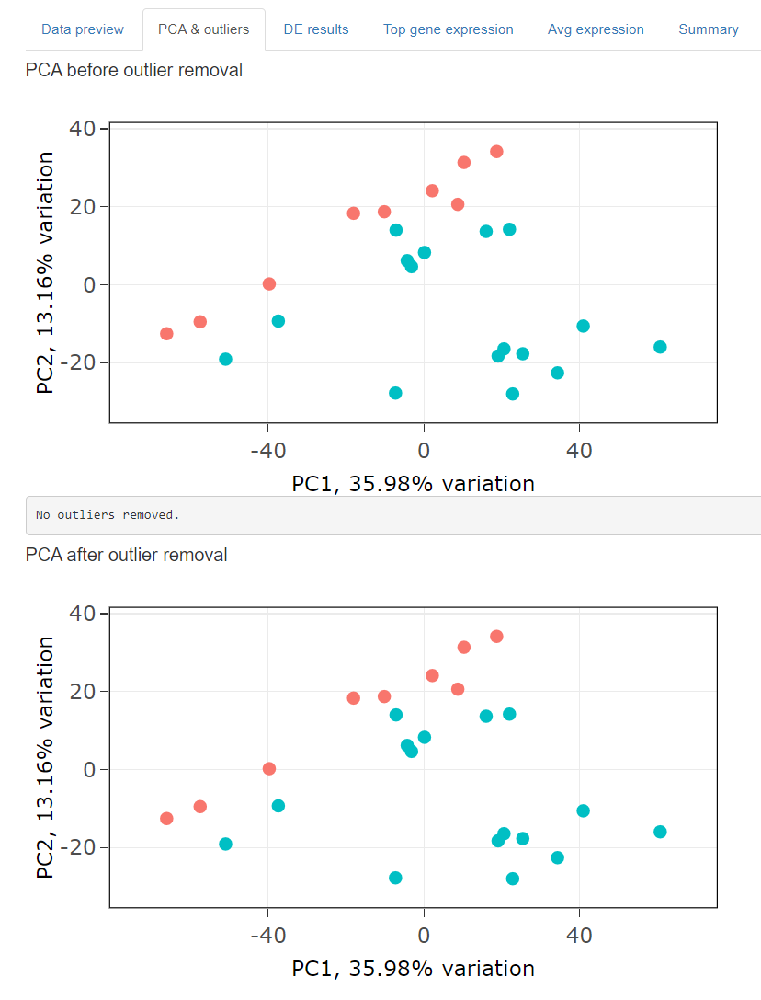
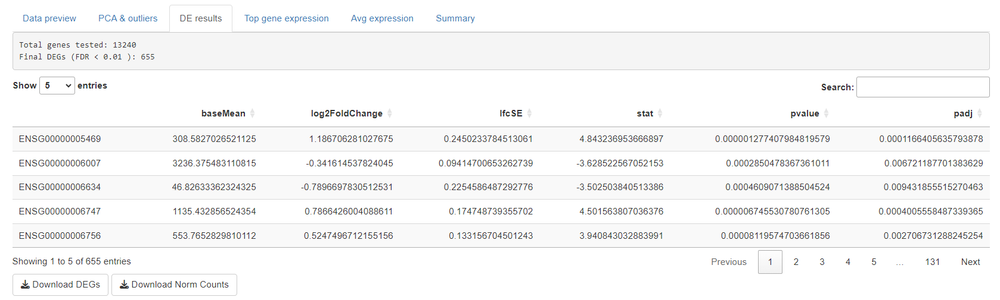
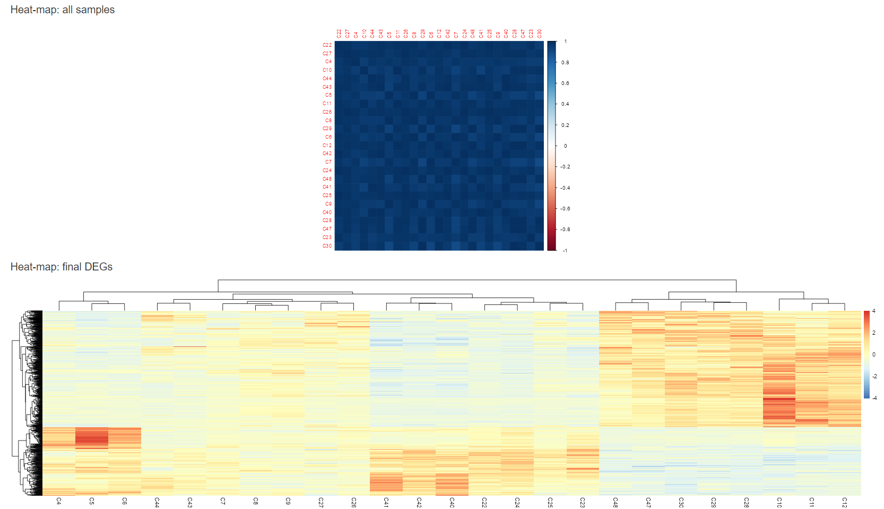
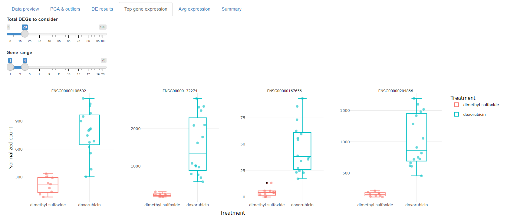
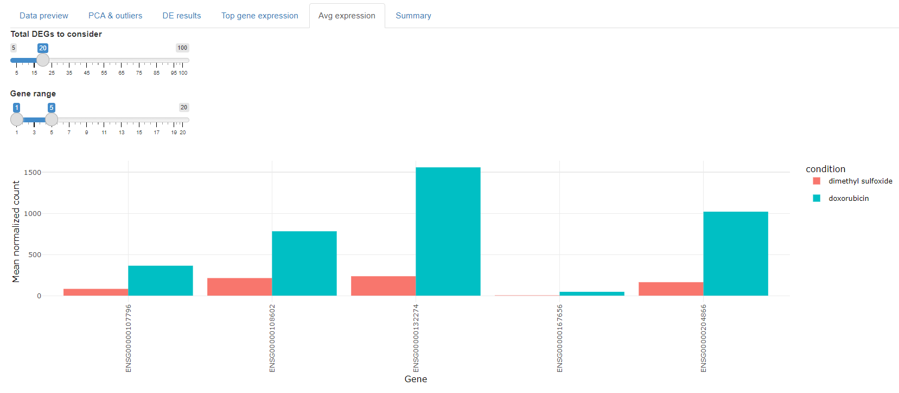

# Tutorial: Human doxorubicin organoid example

This tutorial shows a complete run of the R-ODAF DESeq2 pipeline using
a published human doxorubicin organoid dataset.

---

## Step 0 – Download example data

The example data are publicly available in the R-ODAF GitHub repository.

Download these files to a folder on your computer (e.g. Desktop):

- [Counts matrix – Organoids_NORM_human.txt](https://raw.githubusercontent.com/fcaiment/R-ODAF/shiny-version/Shiny_App/examples/Organoids_NORM_human.txt)
- [Metadata / phenotype – Organoids_meta_human.txt](https://raw.githubusercontent.com/fcaiment/R-ODAF/shiny-version/Shiny_App/examples/Organoids_meta_human.txt)
- [Data description – data_info.txt](https://raw.githubusercontent.com/fcaiment/R-ODAF/shiny-version/Shiny_App/examples/data_info.txt)

The counts file contains normalized RNA-seq counts (genes × samples).  
The metadata file contains sample information, including the treatment group.

---

## Step 1 – Upload counts and metadata

On the **left side** of the Analysis tab you upload all inputs that the pipeline
needs:

- **Counts (genes × samples):** one matrix with genes in rows and samples in
  columns.
- **Metadata (samples × attributes):** one table with samples in rows and
  columns for treatment, dose, time, etc.

In this tutorial we use the doxorubicin-treated human colonoid dataset from
Rodriguez *et al.*, 2022, which was reprocessed with the R-ODAF criteria
(see Lodhi *et al.*, 2025; Verheijen *et al.*, 2022).

1. Open the **Analysis** tab in the app.
2. Under **“Counts (genes × samples)”**, click **Browse** and select  
   `Organoids_NORM_human.txt`.
3. Under **“Metadata (samples × attributes)”**, click **Browse** and select  
   `Organoids_meta_human.txt`.

Once both files are uploaded, the right side of the screen shows them under
**Data preview**:

- The **Counts preview** table should display genes × samples.
- The **Metadata preview** table should display samples × attributes.
- Sample IDs in the metadata row names must match the column names in the
  counts matrix.

---

## Step 2 – Define the design and groups

Below the file inputs on the left, you specify how the study design is encoded
in your metadata:

- **Design column** is the metadata column that defines the comparison
  (in this tutorial: `Treatment`).
- **Control label** is the level you consider as reference  
  (for example: `dimethyl sulfoxide`).
- **Case label** is the exposed or treated level  
  (for example: `doxorubicin`).

In the example dataset, the treatment information is stored in a column called
`Treatment` and the two levels are *dimethyl sulfoxide* (control) and
*doxorubicin* (case).  
If your own metadata uses different names (e.g. a column called `Exposure`
with levels `case` and `control`), make sure to enter those exact names here.

---

## Step 3 – Run the R-ODAF pipeline

After:

- the counts and metadata have been uploaded, and
- the design column and control/case labels are set correctly,

you are ready to start the analysis.

1. Check once more that the **Data preview** tables on the right look
   reasonable (no obvious mismatches).
2. Click **Run analysis** in the sidebar.

A progress bar will appear at the top of the main panel. Wait until the
progress reaches 100 % and the status message shows **“Done.”**.

After the run completes, all downstream tabs are populated:
**“PCA & outliers”**, **“DE results”**, **“Top gene expression”**,  
**“Avg expression”**, and **“Summary”**.

---

## Step 4 – Inspect PCA and outliers

Open the **PCA & outliers** tab to check the principal component analysis
before and after outlier removal:

- **PCA before outlier removal**  
  shows all samples before any R-ODAF outlier filtering.
- **PCA after outlier removal**  
  shows the final sample set used for DESeq2.
- The **Outlier log** in the middle lists which samples were removed (if any).

Here you mainly check that control and doxorubicin samples separate in a
reasonable way and that no obviously bad samples remain.

In this example, the PCA & outliers tab shows that the R-ODAF outlier routine did not remove any samples: the message “No outliers removed.” appears between the two panels, and the “before” and “after” PCA plots are identical. Both DMSO (control) and doxorubicin (case) samples cluster reasonably, with no single sample lying far away from the rest of its group on the first two principal components, so no sample is flagged as an outlier. In other datasets you may see one or more samples removed here; if that happens, always check whether those samples have known technical issues before deciding to keep or discard them.

---

## Step 5 – Explore DE results and heatmaps

Return to the **DE results** tab to interpret the differential expression and
sample-level QC.

1. At the top, confirm the **summary**:
   - total number of genes tested,  
   - number of final DEGs at FDR < 0.01.
2. Use the **DEG table** to inspect individual genes (log2 fold change,
   p-value, adjusted p-value, etc.).
3. Below the table you will find two heatmaps:

   - **Correlation heatmap (all samples)**  
     shows the sample–sample correlation matrix.  
     A uniform dark-blue block, as in this example, indicates that all samples
     are globally similar and there are no obvious outliers.
   - **DEG heatmap**  
     shows expression of the final DEG set across samples, clustered by
     similarity. This is useful to see case vs control separation.

On the DE results tab you see a summary of the statistical output from the T-ROAM / R-ODAF pipeline.
At the top, the summary line reports how many genes were tested and how many passed the final R-ODAF filters at FDR < 0.01. In this example, 13,240 genes were tested and 655 genes are called DEGs.

Below the summary is an interactive DEG table, one row per gene. By default the table is sorted by adjusted p-value (padj), so the most significant genes appear first. The main columns are:

baseMean – mean normalized count across all samples  

log2FoldChange – log₂(case / control) expression change  

lfcSE – standard error of the log₂ fold change  

stat – Wald test statistic  

pvalue – raw p-value  

padj – FDR-adjusted p-value  

You can change how many rows are shown using the “Show … entries” drop-down and use the Search box on the right to filter for specific Ensembl IDs or gene symbols.

At the bottom left, two buttons allow you to export results:

Download DEGs – saves the current DEG table (all rows, all columns) as a CSV file.  

Download Norm Counts – saves the full normalized counts matrix for all genes and all samples, which you can reuse for downstream analyses or plotting in R.

Heat‐map: all samples  
The top heat‐map shows the sample–sample correlation matrix of the normalized counts. Each row and column is one sample; colours represent the Pearson correlation between two samples (dark blue ≈ very high positive correlation).  
In this doxorubicin organoid example almost all cells are dark blue, meaning that every sample is globally very similar to the others. This tells you that there are no obvious “odd” samples or separate clusters of poor-quality samples – it is primarily a QC check.

Heat‐map: final DEGs  
The bottom heat‐map shows expression of the final R-ODAF DEG set (≈655 genes in this example). Rows are genes, columns are samples, and values are z-scaled per gene (yellow = average, red = higher, blue = lower expression). The hierarchical clustering groups together genes with similar expression patterns and samples with similar DEG profiles. In your own data, clear left–right blocks in this heat‐map can indicate good separation between control and exposed samples; more mixed patterns suggest subtler or more heterogeneous responses.

---

## Step 6 – Visualise top genes

After checking the DEG table, you can use the **Top gene expression** and  
**Avg expression** tabs to look at how the most significant genes behave per
sample and per group.

### Top gene expression tab

The **Top gene expression** tab shows per-gene boxplots of normalized counts.

- **Total DEGs to consider** (top slider)  
  selects how many DEGs (ranked by FDR) form the “shortlist”.  
  In the example, the top 20 DEGs are considered.

- **Gene range** (second slider)  
  lets you move a window through this ranked list.  
  With the range set to 1–4, the app shows the first four DEGs; moving the
  window to e.g. 5–8 will show the next four.

- Each panel corresponds to one gene (Ensembl ID on top).  
  On the x-axis you see the **Treatment** groups (dimethyl sulfoxide vs
  doxorubicin); on the y-axis the **normalized counts**.

- Points are individual samples; the boxes summarise the distribution per
  group. A clear shift between the control and doxorubicin boxes indicates a
  strong and consistent treatment effect for that gene.

This view is useful to check whether important DEGs have clean, consistent
differences between control and doxorubicin samples, or whether a gene is
driven by only one or two outlying samples.

### Avg expression tab

The **Avg expression** tab summarizes the same ranked DEGs as bar plots of
mean normalized expression per group.

- The **Total DEGs to consider** and **Gene range** sliders work in exactly the
  same way as on the Top gene tab; the genes shown are the same window in the
  ranked DEG list.

- For each gene you see two bars:  
  - one for the mean normalized count in **dimethyl sulfoxide** samples,  
  - one for the mean normalized count in **doxorubicin** samples.

- This view makes it easy to compare **effect size across genes**: genes with
  large differences between the two bars are strong candidates for follow-up.

---

By completing this tutorial with the human doxorubicin organoid dataset, you
see the full behaviour of the R-ODAF pipeline from input files to
DEG table and expression plots. You can then apply exactly the same steps to
your own RNA-seq experiments.
